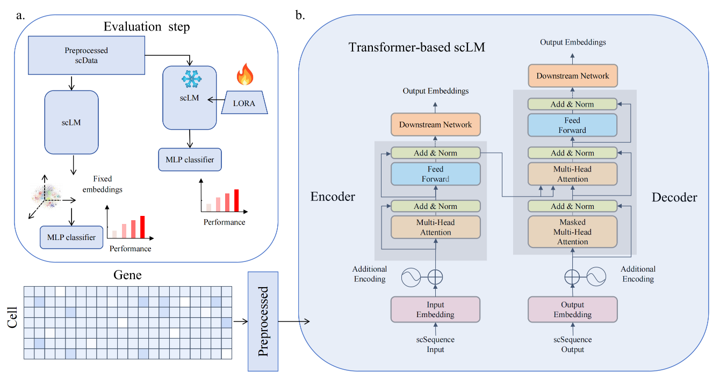

# scDrugMap

### This resource is an implementation of ''Fine-tuned large gene language model to predict drug sensitivity'' (DrugTuner). Our paper is released at [Here](http://。。。。).


## Overview





##  Usage
We provide framework codes for 8 benchmark single-cell language models and 2 large language models for reference. We strongly recommend using our code-free [Webserver](https://scdrugmap.com/)


### Running
   Due to conflicting packages in the environments of various models, we cannot provide a unified running environment. Please refer to the original installation instructions of each project: [Geneformer](https://huggingface.co/ctheodoris/Geneformer), [tGPT](https://github.com/deeplearningplus/tGPT), [UCE](https://github.com/snap-stanford/uce), [scBERT](https://github.com/TencentAILabHealthcare/scBERT), [CellPLM](https://github.com/OmicsML/CellPLM), [OpenBioMed/CellLM](https://github.com/PharMolix/OpenBioMed), [scGPT](https://github.com/bowang-lab/scGPT), [scFoundation](https://github.com/biomap-research/scFoundation). The complete code of the project is in [zenodo](https://scdrugmap.com/).
   
   (1) [Geneformer](https://huggingface.co/ctheodoris/Geneformer)
   ```bash
   # entering the code directory
   $ cd ./benchmark/Geneformer-finetuing-lora-prompt_cell_cls/
   # creating dataset
   $ python dataset_making.py
   # generating fixed embedding
   $ python get_ebd.py
   # train and test by fixed embedding
   $ python benchmarking_main_EBD.py
   # train and test by fine-tuning with LOAR
   $ python benchmarking_main_FT.py
   ```
   
   (2) [tGPT](https://github.com/deeplearningplus/tGPT)
   ```bash
   # entering the code directory
   $ cd ./benchmark/tGPT-main/tGPT-main/tGPT-main/
   # creating dataset
   $ python dataset_making.py
   # generating fixed embedding
   $ python get_ebd.py
   # train and test by fixed embedding
   $ python benchmarking_main_EBD.py
   # train and test by fine-tuning with LOAR
   $ python benchmarking_main_FT.py
   ```

   (3) [UCE](https://github.com/snap-stanford/uce)
   ```bash
   # entering the code directory
   $ cd ./benchmark/UCE-main/UCE-main/
   # creating dataset
   $ python dataset_making.py
   # generating fixed embedding
   $ python get_ebd.py
   # train and test by fixed embedding
   $ python benchmarking_main_EBD.py
   # train and test by fine-tuning with LOAR
   $ python benchmarking_main_FT.py
   ```
   
   (4) [scBERT](https://github.com/TencentAILabHealthcare/scBERT)
   ```bash
   # entering the code directory
   $ cd ./benchmark/scBERT-master/scBERT-master/
   # creating dataset
   $ python dataset_making.py
   # generating fixed embedding
   $ python get_ebd.py
   # train and test by fixed embedding
   $ python benchmarking_main_EBD.py
   # train and test by fine-tuning with LOAR
   $ python benchmarking_main_FT.py
   ```
   
   (5) [CellPLM](https://github.com/OmicsML/CellPLM)
   ```bash
   # entering the code directory
   $ cd ./benchmark/CellPLM-main/CellPLM-main/
   # creating dataset
   $ python dataset_making.py
   # generating fixed embedding
   $ python get_ebd.py
   # train and test by fixed embedding
   $ python benchmarking_main_EBD.py
   # train and test by fine-tuning with LOAR
   $ python benchmarking_main_FT.py
   ```

   (6) [OpenBioMed/CellLM](https://github.com/PharMolix/OpenBioMed)
   ```bash
   # entering the code directory
   $ cd ./benchmark/OpenBioMed-main/OpenBioMed-main/
   # generating fixed embedding
   $ python get_ebd.py
   # train and test by fixed embedding
   $ python benchmarking_main_EBD.py
   # train and test by fine-tuning with LOAR
   $ python benchmarking_main_FT.py
   ```

   (7) [scGPT](https://github.com/bowang-lab/scGPT)
   ```bash
   # entering the code directory
   $ cd ./benchmark/scGPT-main/scGPT-main/scgpt/tasks/
   # generating fixed embedding
   $ python get_ebd.py
   # train and test by fixed embedding
   $ python benchmarking_main_EBD.py
   # train and test by fine-tuning with LOAR
   $ python benchmarking_main_FT.py
   ```

   (8) [scFoundation](https://github.com/biomap-research/scFoundation)
   ```bash
   # entering the code directory
   $ cd ./benchmark/scFoundation-main/scFoundation-main/model/
   # creating dataset
   $ python dataset_making.py
   # generating fixed embedding
   $ python get_ebd.py
   # train and test by fixed embedding
   $ python benchmarking_main_EBD.py
   # train and test by fine-tuning with LOAR
   $ python benchmarking_main_FT.py
   ```

   (9) [Llama](https://github.com/meta-llama/llama3)
   ```bash
   # entering the code directory
   $ cd ./benchmark/Llama/
   # creating dataset
   $ python dataset_making.py
   # generating fixed embedding
   $ python get_embeds.py
   # train and test by fixed embedding
   $ python benchmarking_main_EBD.py
   ```

   (10) [GPT4-mini](https://openai.com/index/gpt-4/)
   ```bash
   # entering the code directory
   $ cd ./benchmark/GPT4/
   # prediction
   $ python main.py
   ```


## Dataset

### Statistics of dataset
| Maintask              | Subtask                                                             | samples | sensitive | resistant | sensitive_percent | resistant_percent |
|-----------------------|---------------------------------------------------------------------|---------|-----------|-----------|-------------------|-------------------|
| all                   | all                                                                 | 326751  | 162957    | 163794    | 0.4987            | 0.5013            |
| Tissue                | Bone marrow aspirate                                                | 73896   | 38918     | 34978     | 0.5267            | 0.4733            |
| Tissue                | Cell line                                                           | 132447  | 55483     | 76964     | 0.4189            | 0.5811            |
| Tissue                | Peripheral blood mononuclear cells                                  | 50533   | 24434     | 26099     | 0.4835            | 0.5165            |
| Tissue                | Tumor tissue                                                        | 69875   | 44122     | 25753     | 0.6314            | 0.3686            |
| Cancer_type_level1    | Multiple myeloma                                                    | 72010   | 37742     | 34268     | 0.5241            | 0.4759            |
| Cancer_type_level1    | Breast cancer                                                       | 20009   | 8355      | 11654     | 0.4176            | 0.5824            |
| Cancer_type_level1    | Lung cancer                                                         | 72431   | 41732     | 30699     | 0.5762            | 0.4238            |
| Cancer_type_level1    | Pancreatic cancer                                                   | 6136    | 698       | 5438      | 0.1138            | 0.8862            |
| Cancer_type_level1    | Prostate cancer                                                     | 10982   | 2290      | 8692      | 0.2085            | 0.7915            |
| Cancer_type_level1    | Neuroblastoma                                                       | 11790   | 5492      | 6298      | 0.4658            | 0.5342            |
| Cancer_type_level1    | Melanoma                                                            | 48125   | 23344     | 24781     | 0.4851            | 0.5149            |
| Cancer_type_level1    | Chronic lymphocytic leukemia                                        | 25699   | 13257     | 12442     | 0.5159            | 0.4841            |
| Cancer_type_level1    | Acute lymphoblastic leukemia                                        | 27912   | 13005     | 14907     | 0.4659            | 0.5341            |
| Cancer_type_level1    | Liver cancer                                                        | 6823    | 5865      | 958       | 0.8596            | 0.1404            |
| Cancer_type_level1    | Acute myeloid leukemia                                              | 24834   | 11177     | 13657     | 0.4501            | 0.5499            |
| Cancer_type_level2    | Refractory multiple myeloma (MM)                                    | 72010   | 37742     | 34268     | 0.5241            | 0.4759            |
| Cancer_type_level2    | Inflammatory breast cancer                                          | 7358    | 1978      | 5380      | 0.2688            | 0.7312            |
| Cancer_type_level2    | EML4-ALK fusion-positive non-small cell lung cancer (NSCLC)         | 6986    | 2364      | 4622      | 0.3384            | 0.6616            |
| Cancer_type_level2    | Pancreatic ductal adenocarcinoma (PDAC)                             | 6136    | 698       | 5438      | 0.1138            | 0.8862            |
| Cancer_type_level2    | EGFR-mutated non-small cell lung cancer (NSCLC)                     | 2393    | 1111      | 1282      | 0.4643            | 0.5357            |
| Cancer_type_level2    | Prostate cancer                                                     | 10982   | 2290      | 8692      | 0.2085            | 0.7915            |
| Cancer_type_level2    | Neuroblastoma                                                       | 11790   | 5492      | 6298      | 0.4658            | 0.5342            |
| Cancer_type_level2    | ER+ breast cancer                                                   | 2669    | 1072      | 1597      | 0.4016            | 0.5984            |
| Cancer_type_level2    | Melanoma                                                            | 6548    | 3286      | 3262      | 0.5018            | 0.4982            |
| Cancer_type_level2    | Chronic lymphocytic leukemia (CLL)                                  | 23657   | 12406     | 11251     | 0.5244            | 0.4756            |
| Cancer_type_level2    | Relapsed B-cell acute lymphoblastic leukemia (B-ALL)                 | 1886    | 1176      | 710       | 0.6235            | 0.3765            |
| Cancer_type_level2    | Advanced hepatocellular carcinoma                                   | 6823    | 5865      | 958       | 0.8596            | 0.1404            |
| Cancer_type_level2    | Small cell lung cancer (SCLC)                                       | 61001   | 37661     | 23340     | 0.6174            | 0.3826            |
| Cancer_type_level2    | EGFR/ALK mutation negative non-small cell lung cancer (NSCLC)       | 2051    | 596       | 1455      | 0.2906            | 0.7094            |
| Cancer_type_level2    | Mucosa-assisted lymphoid tissue (MALT) lymphoma                     | 2042    | 851       | 1191      | 0.4167            | 0.5833            |
| Cancer_type_level2    | Refractory acute myeloid leukemia (AML)                             | 24834   | 11177     | 13657     | 0.4501            | 0.5499            |
| Cancer_type_level2    | Triple-negative breast cancer (TNBC)                                | 9982    | 5305      | 4677      | 0.5315            | 0.4685            |
| Cancer_type_level2    | T-cell acute lymphoblastic leukemia (ALL)                           | 26026   | 11829     | 14197     | 0.4545            | 0.5455            |
| Cancer_type_level2    | BRAFV600E-mutant melanoma                                           | 25859   | 13372     | 12487     | 0.5171            | 0.4829            |
| Cancer_type_level2    | B+E2:E57RAFV600E-mutant melanoma                                    | 15718   | 6686      | 9032      | 0.4254            | 0.5746            |
| Drug_type             | Targeted therapy                                                    | 243856  | 118794    | 125062    | 0.4871            | 0.5129            |
| Drug_type             | Immunotherapy                                                       | 6303    | 2631      | 3672      | 0.4174            | 0.5826            |
| Drug_type             | Chemotherapy                                                        | 76592   | 41532     | 35060     | 0.5422            | 0.4578            |
| Regimen               | carfilzomib + dexamethasone                                         | 3421    | 931       | 2490      | 0.2721            | 0.7279            |
| Regimen               | pomalidomide + dexamethasone OR lenalidomide + dexamethasone        | 34788   | 13069     | 21719     | 0.3757            | 0.6243            |
| Regimen               | DARA-KRD (daratumumab + carfilzomib + lenalidomide + dexamethasone) | 33477   | 23734     | 9743      | 0.709             | 0.291             |
| Regimen               | CAR-T                                                               | 324     | 8         | 316       | 0.0247            | 0.9753            |
| Regimen               | paclitaxel                                                          | 9171    | 3039      | 6132      | 0.3314            | 0.6686            |
| Regimen               | ceritinib                                                           | 6986    | 2364      | 4622      | 0.3384            | 0.6616            |
| Regimen               | gemcitabine                                                         | 6136    | 698       | 5438      | 0.1138            | 0.8862            |
| Regimen               | erlotinib                                                           | 2393    | 1111      | 1282      | 0.4643            | 0.5357            |
| Regimen               | docetaxel                                                           | 284     | 134       | 150       | 0.4718            | 0.5282            |
| Regimen               | TAE684                                                              | 11790   | 5492      | 6298      | 0.4658            | 0.5342            |
| Regimen               | KDM5-C70                                                            | 2669    | 1072      | 1597      | 0.4016            | 0.5984            |
| Regimen               | PLX-4720                                                            | 6548    | 3286      | 3262      | 0.5018            | 0.4982            |
| Regimen               | ibrutinib                                                           | 23657   | 12406     | 11251     | 0.5244            | 0.4756            |
| Regimen               | anti-CD19 CAR-T                                                     | 1886    | 1176      | 710       | 0.6235            | 0.3765            |
| Regimen               | sorafenib                                                           | 6823    | 5865      | 958       | 0.8596            | 0.1404            |
| Regimen               | toripalimab + carboplatin + (docetaxel or pemetrexed or emcitabine) | 1142    | 455       | 687       | 0.3984            | 0.6016            |
| Regimen               | sintilimab + carboplatin + (docetaxel or pemetrexed or emcitabine)  | 909     | 141       | 768       | 0.1551            | 0.8449            |
| Regimen               | rituximab + cyclophosphamide + fludarabine                          | 2042    | 851       | 1191      | 0.4167            | 0.5833            |
| Regimen               | ficlatuzumab                                                        | 24834   | 11177     | 13657     | 0.4501            | 0.5499            |
| Regimen               | JQ1                                                                 | 2626    | 1061      | 1565      | 0.404             | 0.596             |
| Regimen               | palbociclib                                                         | 1754    | 1061      | 693       | 0.6049            | 0.3951            |
| Regimen               | JQ1 + paclitaxel                                                    | 1704    | 1061      | 643       | 0.6227            | 0.3773            |
| Regimen               | JQ1 + palbociclib                                                   | 2085    | 1061      | 1024      | 0.5089            | 0.4911            |
| Regimen               | enzalutamide                                                        | 10698   | 2156      | 8542      | 0.2015            | 0.7985            |
| Regimen               | dasatinib                                                           | 26026   | 11829     | 14197     | 0.4545            | 0.5455            |
| Regimen               | vemurafenib                                                         | 11008   | 6686      | 4322      | 0.6074            | 0.3926            |
| Regimen               | vemurafenib + combimetinib                                          | 14851   | 6686      | 8165      | 0.4502            | 0.5498            |
| Regimen               | vemurafenib + trametinib                                            | 15718   | 6686      | 9032      | 0.4254            | 0.5746            |


## Results

Please refer to our paper.


## Reference
```
[1].Shen, H. et al. Generative pretraining from large-scale transcriptomes: Implications for single-cell deciphering and clinical translation. bioRxiv, 2022.2001. 2031.478596 (2022).
[2].Yang, F. et al. scBERT as a large-scale pretrained deep language model for cell type annotation of single-cell RNA-seq data. Nature Machine Intelligence 4, 852-866 (2022).
[3].Theodoris, C.V. et al. Transfer learning enables predictions in network biology. Nature 618, 616-624 (2023).
[4].Zhao, S., Zhang, J. & Nie, Z. Large-scale cell representation learning via divide-and-conquer contrastive learning. arXiv preprint arXiv:2306.04371 (2023).
[5].Hao, M. et al. Large-scale foundation model on single-cell transcriptomics. Nature Methods, 1-11 (2024).
[6].Cui, H. et al. scGPT: toward building a foundation model for single-cell multi-omics using generative AI. Nature Methods, 1-11 (2024).
[7].Wen, H. et al. CellPLM: pre-training of cell language model beyond single cells. bioRxiv, 2023.2010. 2003.560734 (2023).
[8].Rosen, Y. et al. Universal cell embeddings: A foundation model for cell biology. bioRxiv, 2023.2011. 2028.568918 (2023).
[9].AI@Meta Llama 3 Model Card. https://huggingface.co/meta-llama/Meta-Llama-3-8B (2024).
[10].OpenAI GPT-4o mini. https://openai.com/index/gpt-4o-mini-advancing-cost-efficient-intelligence/ (2024).
```
